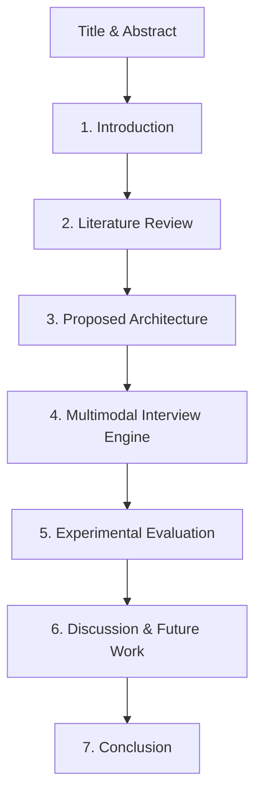

# DreamRole: Academic Paper Publication Guide & Outline

This guide outlines the strategy, paper structure, and target venues for publishing **DreamRole** as a peer-reviewed research paper.

---

## 🔬 1. Why DreamRole is Publishable (Research Novelty)
To publish a project in an academic venue, it needs to present a **novel contribution** or an innovative application of existing technologies. DreamRole has several key aspects that make it a strong candidate for research:

1. **Multimodal AI Assessment (CV + Audio + NLP)**:
   It integrates real-time client-side computer vision (facial expressions via `face-api.js`), audio processing (voice metrics, volume, pauses, pace via Web Audio API), and semantic natural language processing (automated prompt-based transcript grading).
2. **Edge-Based AI Privacy & Efficiency**:
   By conducting facial analysis and audio extraction directly in the user's browser, the system minimizes server computational costs and protects candidate privacy (sensitive video/audio frames are processed locally and never uploaded to the cloud).
3. **Data-Driven Adaptive Learning Pathways**:
   It maps a student's existing resume to their career target using LLMs to automatically identify skill gaps, generate tailored MCQs, and draft progressive roadmap pipelines.

---

## 📝 2. Proposed Research Paper Title Options
* **Option A**: *"DreamRole: A Multimodal Edge-AI System for Career Readiness and Real-Time Interview Simulation"* (Recommended)
* **Option B**: *"Bridging the Industry Skill Gap: An Adaptive AI-Driven Platform with Real-Time Emotion and Voice Analytics"*
* **Option C**: *"Privacy-Preserving Client-Side Multimodal Analytics for Automated Job Interview Assessment"*

---

## 📄 3. Academic Paper Abstract Draft
> **Abstract**—The transition from academic education to industry employment presents a significant skill alignment challenge for entry-level candidates. Existing career assessment platforms often rely on static questionnaires or compute-heavy cloud-based video analysis that raises user privacy concerns. In this paper, we present *DreamRole*, an end-to-end Career Intelligence Platform designed to bridge this industry-skill gap. DreamRole extracts applicant skill profiles from resumes using Natural Language Processing (NLP), evaluates core competence via LLM-generated adaptive assessments, and provides personalized learning roadmaps. Crucially, the platform features a real-time, privacy-preserving mock interview simulator. By leveraging client-side Web Audio and computer vision models, DreamRole tracks candidate speech patterns (pace, hesitation, confidence) and facial expressions (dominant emotions) entirely on the edge, without uploading video streams to external servers. Captured responses are then batch-evaluated using an LLM-driven, multi-criteria semantic rubric. Preliminary evaluations show that the system achieves high user engagement and provides formative feedback comparable to human mock interviewers, making scalable career coaching accessible to diverse populations.

---

## 🏛️ 4. Recommended Publication Venues ("Where to Publish")

### Category 1: Human-Computer Interaction & Educational Technology (Highest Fit)
These venues focus on how technology supports learning, career development, and interaction:
* **Conferences**:
  * **IEEE Integrated STEM Education Conference (ISEC)**: Very welcoming to undergraduate and early graduate research.
  * **ACM Technical Symposium on Computer Science Education (SIGCSE)**: Highly respected venue for computing education.
  * **IEEE Frontiers in Education (FIE)**: Focuses on engineering and computing education systems.
* **Journals**:
  * **IEEE Transactions on Learning Technologies**: High impact, peer-reviewed.
  * **Computer Applications in Engineering Education (Wiley)**: Highly relevant for engineering student tool papers.

### Category 2: Artificial Intelligence & Interactive Systems
* **Conferences**:
  * **International Conference on Intelligent Tutoring Systems (ITS)**: Focuses on intelligent systems helping users learn or perform.
  * **IEEE International Conference on Tools with Artificial Intelligence (ICTAI)**: Practical applications of AI in real-world software.
* **Journals**:
  * **Applied Intelligence (Springer)**: Broad AI journal welcoming practical implementation papers.

### Category 3: Undergraduate Research Venues (Beginner-Friendly)
If this is your first research paper and you want a smoother review process:
* **Journal of Student Research (JSR)**: Multidisciplinary, specifically designed for undergraduate and high school student work.
* **International Journal of Undergraduate Research and Creative Activities**: Focused on undergraduate-led scholarship.
* **Your Local University Conference/Symposium**: Check with your "mam" (advisor) if your university hosts a student research day.

---

## 📐 5. Detailed Paper Structure & Outline ("How to Write It")

A standard IEEE/ACM computer science paper is 6 to 8 pages in two-column format. Below is the proposed layout for your paper:



### Section I: Introduction
* **Objective**: Explain the problem and why it matters.
* **Content**:
  * The "Skill Gap" problem: Why college graduates struggle to find roles that match industry demands.
  * The limitation of current tools (generic job boards, high cost of human coaching).
  * Introduce **DreamRole**: A multimodal, privacy-preserving assistant.
  * List **3 Contributions**:
    1. A unified pipeline for resume parsing, gap identification, adaptive testing, and roadmap synthesis.
    2. A client-side, edge-based multimodal analysis system for voice and facial tracking.
    3. An LLM-in-the-loop rubric grading engine that matches performance against dynamic expert rubrics.

### Section II: Literature Review / Related Work
* **Objective**: Show you understand what already exists and how DreamRole is better.
* **Compare against**:
  * *Automated Resume Parsers*: Typically use basic keyword matching; DreamRole uses LLM semantic entity extraction.
  * *AI Interview Tools (e.g., HireVue)*: They upload videos to servers, causing privacy debates; DreamRole does edge processing.
  * *Roadmap Generator Tools*: Often static; DreamRole integrates adaptive testing results directly.

### Section III: System Design & Architecture
* **Objective**: Detail the software engineering aspect.
* **Provide System Diagram**: Show the flow from Resume Upload $\rightarrow$ Firebase Auth $\rightarrow$ OpenAI API Orchestration $\rightarrow$ Local Browser API.
* **Orchestration Service**: Detail how the Express backend acts as an orchestrator using the controller-service-repository pattern (refer to `DREAMROLE_ARCHITECT_SPEC.md`).
* **Multi-Agent Prompts**: List the system rules and formats used for the extraction and feedback agents.

### Section IV: Multimodal Interview Simulator (Core Novelty)
* **Objective**: Explain the math, models, and execution of the real-time simulation.
* **Facial Emotion Processing (CV)**:
  * Explain how `face-api.js` loads a lightweight `TinyFaceDetector` model on the client.
  * Explain the tracking loop ($800\text{ ms}$ interval) mapping inputs to 7 emotion probabilities (Neutral, Happy, Sad, Angry, Fearful, Surprised, Disgusted).
* **Audio Metrics Processing (DSP)**:
  * Describe how the **Web Audio API** creates an analyzer node ($fftSize = 256$) to measure amplitude and calculate average volume.
  * Describe how the **Web Speech API** performs Speech-to-Text (STT) locally to calculate:
    $$\text{Speaking Pace (WPM)} = \frac{\text{Word Count}}{\text{Elapsed Minutes}}$$
  * Explain the Silence/Pause Detection: Flagging silent periods exceeding $2000\text{ ms}$ as a pause indicator.
* **Rubric Grading & LLM-in-the-Loop Evaluation**:
  * Show how the LLM receives the transcript, the model answer guidelines, and the emotional state to output a structured JSON evaluation scoring four fields (Technical Accuracy, Specificity, Clarity, and Role Relevance).

### Section V: Experimental Evaluation / Results
* **Objective**: Prove the system works.
* *Note: If you don't have human study data yet, you can run a "Simulation/Accuracy study"*:
  * **Test Case Study**: Run 10-15 sample resumes through the system. Measure average latency of LLM calls, cache hit rates ($node-cache$), and accuracy of skill extraction compared to human manual review.
  * **Performance Overheads**: Show that client-side emotion and voice tracking doesn't freeze the UI (FPS benchmarks).
  * **Example Output Case**: Show a screenshot or text diff of a mock interview feedback report generated for a candidate.

### Section VI: Discussion & Limitations
* **Limitations to address**:
  * Speech recognition depends on the browser engine (best in Chrome).
  * Local models require a modern machine; older machines might experience frame drops.
  * Dependency on Internet access for LLM evaluation.
* **Privacy Aspects**: Explain the choice of keeping video datasets on the client to avoid GDPR and data security issues.

### Section VII: Conclusion & Future Work
* Summary of the system and its benefits.
* Future directions: Integrating live video rendering of the AI interviewer, expanding to multiple languages, and direct LinkedIn job feed integration.

---

## 🚀 6. Step-by-Step Publication Roadmap ("How to Do It")

```
   [Step 1] Collaborate with your Mam (Advisor) 
                   │
                   ▼
   [Step 2] Choose Template (IEEE LaTeX template)
                   │
                   ▼
   [Step 3] Draft the Content (Focus on Section IV & V)
                   │
                   ▼
   [Step 4] Run a Small User Evaluation (10-15 students)
                   │
                   ▼
   [Step 5] Format & Check Similarity Index (Plagiarism check)
                   │
                   ▼
   [Step 6] Submit to the chosen Conference / Journal
```

1. **Get your Advisor on Board**: 
   Show her this outline. Ask her to be the **co-author**. Having a professor as a co-author is crucial because they know the academic standards and can cover the conference registration fees.
2. **Draft in LaTeX (Overleaf)**: 
   Do not write in Microsoft Word. Use [Overleaf](https://www.overleaf.com), the industry standard. Use the **IEEE Conference Template** or **ACM Article Template**.
3. **Run a Mini-Study (Crucial for Reviewers)**:
   Ask 10 of your classmates or friends to test DreamRole. Let them upload their resumes, run the interview, and receive feedback. Give them a quick questionnaire (scale of 1-5):
   * *Was the skill extraction accurate?*
   * *Was the voice metrics tracking helpful?*
   * *Did the AI feedback feel constructive?*
   Include these survey graphs in **Section V: Results**.
4. **Choose a Conference and Watch the Deadline**:
   Conferences have strict submission deadlines. Submit your PDF through portals like EasyChair or OpenReview as instructed by the conference website.
